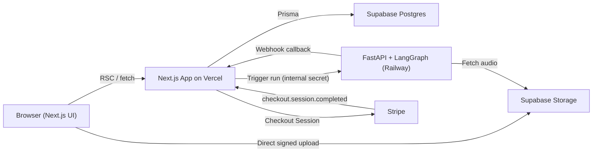

# Scopelancer

Scopelancer helps freelancers eliminate scope creep by turning a recorded client meeting into a structured, actionable artifact: a validated scope summary, an architecture diagram, and a ready-to-send follow-up email sequence.

Upload the recording of a client kickoff call. Scopelancer transcribes it, extracts the project's real scope and deadlines into a strict structured format, visualizes it as a diagram, and drafts a multi-day follow-up sequence in your own tone — so the scope you agreed to in the room is the scope that gets documented, diagrammed, and defended in writing.

This project doubles as a deliberate learning exercise in full-stack architecture and applied AI engineering. The codebase is being built incrementally, with an emphasis on understanding *why* each architectural decision was made, not just shipping features.

## How it works

1. **Upload** a recording of a client meeting (`.mp3`, `.m4a`, `.webm`, `.wav`, `.ogg`/`.opus`).
2. **Transcribe** — the audio is transcribed via Groq's hosted Whisper.
3. **Parse** — the transcript is mapped into a strict, validated JSON structure of project variables, scope, and deadlines (Node 1).
4. **Visualize** — the scope structure is turned into a Mermaid.js diagram via Claude Sonnet (Node 2).
5. **Draft** — a strategic, multi-day follow-up email sequence is written in the freelancer's own tone via Claude Sonnet (Node 3).
6. **Review** — results stream back into the dashboard in real time as each stage completes.

## Architecture at a glance

Scopelancer is split into two independently deployed services that communicate over an authenticated internal API, unified by a single Postgres database as the source of truth.



- **`apps/web`** — Next.js (App Router). UI, auth, database access, Stripe billing, and pipeline orchestration all live here. This is the only service that talks to Postgres.
- **`apps/ai-service`** — FastAPI + LangGraph. A stateless worker that runs the transcription-to-email pipeline as a durable state machine and reports results back to `apps/web` via webhook callbacks. It never touches the database directly.

Full architectural rationale, data-flow diagrams, database schema design, the LangGraph pipeline design, and the billing model live in the project's planning docs and will be expanded as each phase is implemented.

## Tech stack

**Frontend / Backend**

- **Next.js** (App Router) — UI, Server Components, and API Route Handlers
- **Subframe** + **shadcn/ui** + **Tailwind CSS** — UI design and component styling
- **Vercel** — deployment
- **Supabase (Postgres)** + **Prisma ORM** — database and schema management
- **Better Auth** (Prisma adapter, Google OAuth) — authentication

**AI / Agentic pipeline**

- **Python** + **FastAPI** — service host
- **LangGraph** — sequential state-machine pipeline orchestration
- **Groq Whisper** — audio transcription (input gate)
- **Claude Sonnet** — scope-to-diagram (Mermaid.js) and scope-to-email generation

**Payments**

- **Stripe** — prepaid credit-wallet billing. Users purchase credit packs; each pipeline run is metered against actual usage (audio duration + token counts) and deducted from an append-only credit ledger.

## Repository structure

```
scopelancer/
  apps/
    web/           # Next.js app: UI, auth, Prisma, Stripe
    ai-service/    # FastAPI + LangGraph pipeline
  packages/        # Shared contracts/types (introduced once needed)
```

Managed as a pnpm workspace monorepo. `apps/web` deploys to Vercel; `apps/ai-service` deploys independently to Railway.

## Project status

Currently in the architecture and planning phase. Build phases, in order:

1. Foundation — monorepo scaffold, Prisma schema, Better Auth + Google OAuth
2. Frontend shell — dashboard and project layouts
3. Upload pipeline — signed audio uploads to Supabase Storage
4. AI service scaffold — FastAPI skeleton, service-to-service auth
5. LangGraph pipeline — the four processing nodes with structured-output validation
6. Realtime + results UI — live progress and rendered outputs
7. Billing — credit ledger, Stripe Checkout, usage metering and reconciliation
8. Hardening — pipeline checkpointing, rate limiting, observability

## Getting started

Setup instructions will be added once the Phase 1 scaffold (monorepo, Next.js app, Prisma schema, and auth) lands.
