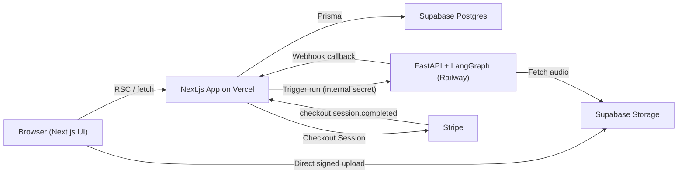

# Scopelancer

Scopelancer helps freelancers eliminate scope creep by turning a recorded client meeting into a structured, actionable artifact: a validated scope summary, an architecture diagram, and a ready-to-send follow-up email sequence.

Upload the recording of a client kickoff call. Scopelancer transcribes it, extracts the project's real scope and deadlines into a strict structured format, visualizes it as a diagram, and drafts a multi-day follow-up sequence in your own tone — so the scope you agreed to in the room is the scope that gets documented, diagrammed, and defended in writing.

This project doubles as a deliberate learning exercise in full-stack architecture and applied AI engineering. The codebase is being built incrementally, with an emphasis on understanding *why* each architectural decision was made, not just shipping features.

## How it works

1. **Upload** a recording of a client meeting (`.mp3`, `.m4a`, `.webm`, `.wav`, `.ogg`/`.opus`).
2. **Transcribe** — the audio is transcribed via Groq's hosted Whisper.
3. **Parse** — the transcript is mapped into a strict, validated JSON structure of project variables, scope, and deadlines (Node 1).
4. **Visualize** — the scope structure is turned into a Mermaid.js diagram via Claude Sonnet (Node 2).
5. **Draft** — a strategic, multi-day follow-up email sequence is written in the freelancer's own tone via Claude Sonnet (Node 3).
6. **Review** — results stream back into the dashboard in real time as each stage completes.

## Architecture at a glance

Scopelancer is split into two independently deployed services that will communicate over an authenticated internal API, unified by a single Postgres database as the source of truth.


```mermaid
flowchart LR
    Browser["Browser (Next.js UI)"]
    NextApp["Next.js App on Vercel"]
    SupabaseStorage["Supabase Storage"]
    SupabaseDb["Supabase Postgres"]
    AiService["FastAPI + LangGraph (Railway)"]
    Stripe["Stripe"]

    Browser -->|"RSC / fetch"| NextApp
    Browser -->|"Direct signed upload"| SupabaseStorage
    NextApp -->|"Prisma"| SupabaseDb
    NextApp -->|"Trigger run (internal secret)"| AiService
    AiService -->|"Fetch audio"| SupabaseStorage
    AiService -->|"Webhook callback"| NextApp
    NextApp -->|"Checkout Session"| Stripe
    Stripe -->|"checkout.session.completed"| NextApp
```

- **`app/web`** — Next.js (App Router). UI, auth, database access, and (soon) Stripe billing and pipeline orchestration all live here. This is the only service that talks to Postgres.
- **`app/ai`** — reserved for the FastAPI + LangGraph worker. A stateless service that will run the transcription-to-email pipeline as a durable state machine and report results back to `app/web` via webhook callbacks. Not started yet — currently an empty placeholder.

Full architectural rationale, data-flow diagrams, database schema design, the LangGraph pipeline design, and the billing model live in the project's planning docs and will be expanded as each phase is implemented.

## Tech stack

**Frontend / Backend**

- **Next.js 16** (App Router) — UI, Server Components, and API Route Handlers
- **shadcn/ui** + **Tailwind CSS v4** — component styling (Subframe integration is still planned but not yet wired in)
- **Vercel** — deployment target
- **Supabase (Postgres)** + **Prisma ORM 7** (via `@prisma/adapter-pg`) — database and schema management
- **Better Auth** (Prisma adapter) — authentication, with **email/password**, **Google OAuth**, and **GitHub OAuth** all enabled
- **TanStack Query** — client-side data fetching/caching for session and user state

**AI / Agentic pipeline** *(not started)*

- **Python** + **FastAPI** — service host
- **LangGraph** — sequential state-machine pipeline orchestration
- **Groq Whisper** — audio transcription (input gate)
- **Claude Sonnet** — scope-to-diagram (Mermaid.js) and scope-to-email generation

**Payments** *(scaffolded, not wired up)*

- **Stripe** — SDK installed and initialized; prepaid credit-wallet billing model designed (see the architecture plan) but the ledger schema, Checkout flow, and webhooks are not yet implemented.

## Repository structure

```
scopelancer/
  app/
    web/
      scopelancer/     # the actual Next.js app (App Router, Prisma, Better Auth, Stripe SDK)
    ai/                 # reserved for the FastAPI + LangGraph service — currently empty
```

Note: `app/web/scopelancer` has an extra nesting level from the initial `create-next-app` scaffold. It works fine as-is; flattening it is a cosmetic cleanup, not a blocker. There is no root-level `package.json`/workspace config yet tying `app/web` and `app/ai` together — that formal monorepo wiring is still pending.

## Project status

Tracking against the 8-phase roadmap from the architecture plan:

- [x] **Phase 1 — Foundation** — *Done, one gap remaining.* Better Auth wired with the Prisma adapter (email/password, Google OAuth, GitHub OAuth). Session cookies, protected-route middleware (`/dashboard`, `/sessions`, `/billings`, `/profile`, `/plan`), and logout all work end-to-end. Database schema v1 in place: `User`, `Admin`, `Session`, `Account`, `Verification` (Better Auth) plus a domain `AppSession` model and an early `Billing` stub. Remaining gap: no `.env.example` / environment conventions documented yet, and there's no root-level workspace config tying `app/web` and `app/ai` together.
- [ ] **Phase 2 — Frontend shell** — *In progress.* Dashboard, sessions list, and billing pages exist, built on shared `NavBar`/`SideBar` components and shadcn primitives, plus session creation (`POST /api/sessions/users`) and profile get/update API routes. Most on-page data (credit balances, session counts, statuses) is still hardcoded placeholder content — wiring it to real Prisma queries is the next step, along with finishing the session creation form.
- [ ] **Phase 3 — Upload pipeline** — *Not started.* No Supabase Storage signed-upload flow yet.
- [ ] **Phase 4 — AI service scaffold** — *Not started.* `app/ai` is an empty placeholder; no FastAPI project exists yet.
- [ ] **Phase 5 — LangGraph pipeline** — *Not started.*
- [ ] **Phase 6 — Realtime + results UI** — *Not started.*
- [ ] **Phase 7 — Billing** — *Not started.* Stripe SDK is installed and initialized (`lib/stripe/stripe.ts`) and credit packs are mocked up on the billing page UI, but there's no credit ledger schema, real Checkout session creation, or webhook handling yet.
- [ ] **Phase 8 — Hardening** — *Not started.*

See the project's architecture plan for the full phased roadmap and rationale behind each decision.

## Getting started

Setup instructions will be added once environment conventions (`.env.example` for each service) are finalized.
